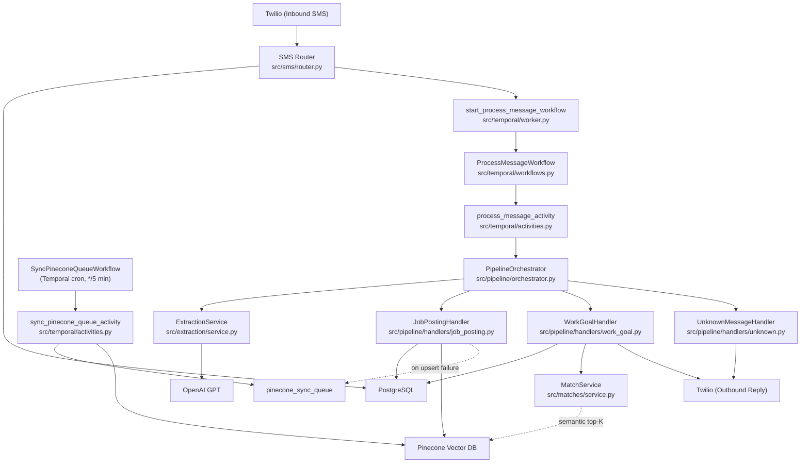

<!-- generated-by: gsd-doc-writer -->
# Architecture

## System Overview

Vici is an SMS-driven workforce matching platform built on FastAPI. Workers and job posters interact with the system by sending text messages via Twilio. Inbound SMS messages are validated, deduplicated, and persisted to PostgreSQL inside the webhook handler, then dispatched to a Temporal workflow that classifies the message via OpenAI (GPT) and routes it through a Chain of Responsibility pipeline to persist a job posting, a worker goal, or reply to an unknown message. A standalone matching engine uses a 0/1 knapsack dynamic-programming algorithm to select jobs that meet a worker's earnings target while minimizing duration, honoring the worker's stated deadline and (when available) narrowing the candidate pool via Pinecone semantic search. Temporal orchestrates durable workflow execution (message processing plus a Pinecone vector-sync cron), and OpenTelemetry, Prometheus, structlog, and Braintrust provide observability. The architecture follows a domain-organized, event-driven style with explicit dependency injection assembled at FastAPI startup.

## Component Diagram



## Data Flow

A typical inbound SMS follows this path:

1. **Twilio webhook** — Twilio delivers the message to `POST /webhook/sms`. The route-dependency chain in `src/sms/dependencies.py` runs four gates in order: `validate_twilio_request` (signature verification, required-field check), `check_idempotency` (rejects duplicate `MessageSid`), `get_or_create_user` (upserts a `user` row by phone hash), and `enforce_rate_limit` (per-user sliding window).
2. **Persist and dispatch** — the route body in `src/sms/router.py` writes a `Message` row and an `audit_log` entry inside a single `session.begin()` transaction, then calls `start_process_message_workflow` (`src/temporal/worker.py`) to start a `ProcessMessageWorkflow` in Temporal (fire-and-forget). The handler returns an empty TwiML response immediately.
3. **Temporal workflow** — `ProcessMessageWorkflow` (in `src/temporal/workflows.py`) executes `process_message_activity` with a retry policy built from the constants in `src/temporal/constants.py` (exponential backoff, 4 max attempts, 1 s initial interval, coefficient 2.0, 5 min max interval). If retries are exhausted, it calls `handle_process_message_failure_activity`, which increments the `pipeline_failures_total{function="process-message"}` Prometheus counter.
4. **Pipeline orchestration** — `process_message_activity` (in `src/temporal/activities.py`) opens a database session, resolves the `Message` row by `message_sid`, and calls `PipelineOrchestrator.run`. The orchestrator first calls `ExtractionService.process` to classify and extract structured data via GPT, then writes a `gpt_classified` audit entry.
5. **Handler dispatch** — the orchestrator iterates its handler list (Chain of Responsibility) and invokes the first whose `can_handle` returns `True`:
   - `JobPostingHandler` — inserts a `Job` row, updates `message.message_type = 'job_posting'`, writes a `job_created` audit entry, commits the transaction, then attempts a direct Pinecone embedding upsert. On upsert failure the job is enqueued into the `pinecone_sync_queue` table (via a fresh session) for later retry.
   - `WorkGoalHandler` — inserts a `WorkGoal` row (including the extracted `target_deadline`), writes a `work_goal_created` audit entry, then runs `MatchService.match` inside the same unit of work (knapsack job selection plus `match` rows). Candidate retrieval is hybrid: when the semantic searcher is bound, the raw SMS text is embedded and Pinecone returns a relevance-ranked top-K that Postgres re-checks for eligibility (status, pay, deadline); thin results, an empty index, or any Pinecone/OpenAI failure fall back to the full Postgres scan. Jobs scheduled after the worker's deadline are excluded unless undated or `datetime_flexible`. After the orchestrator commits, a deferred action sends the formatted match list (`format_match_sms`) back to the sender via Twilio.
   - `UnknownMessageHandler` — catch-all terminal handler; marks the message as `unknown`, commits, and sends a clarifying reply via the Twilio REST client (offloaded with `asyncio.to_thread` since `twilio.rest.Client` is synchronous).
6. **Pinecone sync cron** — `SyncPineconeQueueWorkflow`, registered as a Temporal cron by `start_cron_if_needed` on startup (default schedule `*/5 * * * *`, workflow id `sync-pinecone-queue-cron`), invokes `sync_pinecone_queue_activity`. The activity sweeps up to 50 pending rows from `pinecone_sync_queue`, upserts embeddings via `write_job_embedding`, and marks rows as `synced` or `failed` (incrementing the `attempts` column).
7. **Rate-limit purge cron** — `PurgeRateLimitWorkflow` (hourly, workflow id `purge-rate-limit-cron`) deletes `rate_limit` rows older than the retention window; rolling-window rate limiting inserts one row per admitted message, so the table would otherwise grow without bound.
8. **Gauge updater** — a background asyncio task started in `lifespan` polls every 15 seconds and updates two Prometheus gauges independently: `pinecone_sync_queue_depth` (pending rows via `PineconeSyncQueueRepository.count_pending`) and `temporal_queue_depth` (approximate workflow + activity task backlog via `get_task_queue_backlog` in `src/temporal/stats.py`, using Temporal's enhanced `DescribeTaskQueue` API). A failure in one poll never blinds the other gauge; after repeated consecutive failures a gauge reads `-1` to signal unreliability.

## Key Abstractions

| Abstraction | File | Purpose |
|---|---|---|
| `PipelineOrchestrator` | `src/pipeline/orchestrator.py` | Coordinates extraction and Chain-of-Responsibility handler dispatch for each inbound message |
| `MessageHandler` (ABC) | `src/pipeline/handlers/base.py` | Chain of Responsibility interface — `can_handle(result)` + `handle(ctx)` |
| `PipelineContext` | `src/pipeline/context.py` | Dataclass passed to handlers carrying session, extraction result, and message metadata |
| `ExtractionService` | `src/extraction/service.py` | Wraps OpenAI structured-output calls (`beta.chat.completions.parse`) with tenacity retry, Prometheus metrics, and OTel spans |
| `ExtractionResult` | `src/extraction/schemas.py` | Pydantic model with a `Literal["job_posting","work_goal","unknown"]` `message_type` discriminator and optional `job` / `work_goal` / `unknown` variant fields |
| `MatchService` | `src/matches/service.py` | Hybrid candidate retrieval (Pinecone semantic top-K with Postgres eligibility re-check and full-scan fallback) plus knapsack job selection optimizing earnings toward target, then minimizing duration, honoring the goal deadline |
| `BaseRepository` | `src/repository.py` | Template Method base providing a flush-only `_persist`; caller owns the transaction |
| `Settings` | `src/config.py` | Pydantic `BaseSettings` with nested sub-models (`SmsSettings`, `ExtractionSettings`, `PineconeSettings`, `ObservabilitySettings`, `TemporalSettings`) remapped from flat env vars via a `model_validator` |
| `ProcessMessageWorkflow` | `src/temporal/workflows.py` | Temporal durable workflow wrapping `process_message_activity` with retry and a failure-handler activity |
| `SyncPineconeQueueWorkflow` | `src/temporal/workflows.py` | Temporal cron workflow that drives `sync_pinecone_queue_activity` on a `*/5 * * * *` schedule |

## Directory Structure Rationale

```
src/
├── config.py              # Global Settings (Pydantic BaseSettings with nested sub-models)
├── database.py            # Async SQLAlchemy engine, sessionmaker, and FastAPI get_session dep
├── main.py                # FastAPI app factory, lifespan DI wiring, OTel/Prometheus setup
├── metrics.py             # Prometheus gauge, counter, and histogram definitions
├── models.py              # Central model registry (imports all domain models for Alembic)
├── money.py               # Cents/dollars conversion utilities (monetary values stored as integer cents)
├── repository.py          # BaseRepository ABC with flush-only _persist (Template Method)
├── extraction/            # OpenAI GPT integration — service, prompts, structured schemas,
│                          #   PineconeSyncQueue model, and Pinecone embedding utils
├── jobs/                  # Job posting domain — model, repository, schemas
├── matches/               # Matching engine — knapsack service, repository, schemas, result formatter
├── pipeline/              # Message processing pipeline — orchestrator, context, and handler chain
│   └── handlers/          # Concrete handlers: job_posting, work_goal, unknown
├── sms/                   # Twilio SMS domain — router, dependency gates, service, repository,
│                          #   audit_repository, outbound sender, models, exceptions, error_handlers
├── temporal/              # Temporal workflows, activities, worker bootstrap, and constants
├── users/                 # User domain — model and repository
└── work_goals/            # Worker goal domain — model, repository, schemas

migrations/                # Alembic migration versions
infra/                     # Pulumi IaC for GKE (components: cluster, database, ingress, temporal, etc.)
grafana/                   # Grafana dashboard provisioning
prometheus/                # Prometheus scrape configuration
jaeger/                    # Jaeger collector/query configuration (OpenSearch backend)
tests/                     # pytest async test suite
```

The project is organized by **domain** rather than by technical layer. Each domain directory (`jobs/`, `sms/`, `matches/`, `work_goals/`, etc.) contains its own models, repositories, schemas, and service logic, following the convention described in `AGENTS.md`. Cross-domain imports use explicit module aliases (e.g., `from src.sms import service as sms_service`) to keep boundaries obvious in call sites.

The `pipeline/` module is the central coordination layer: it depends on `extraction/` for classification and delegates to domain-specific handlers via the Chain of Responsibility pattern, keeping the orchestrator itself free of domain logic. The `temporal/` module provides durable execution guarantees, decoupling the synchronous webhook response from the asynchronous processing pipeline and owning the `SyncPineconeQueueWorkflow` cron that drains the `pinecone_sync_queue` fallback table.

Infrastructure concerns (observability, database session management, metric definitions, money utilities, the base repository) live directly under `src/` because they are cross-cutting and consumed by every domain. The DI graph itself is assembled exactly once in `main.py`'s `lifespan` context manager and attached to `app.state` so the webhook handler and Temporal activity can share the same orchestrator and clients.
