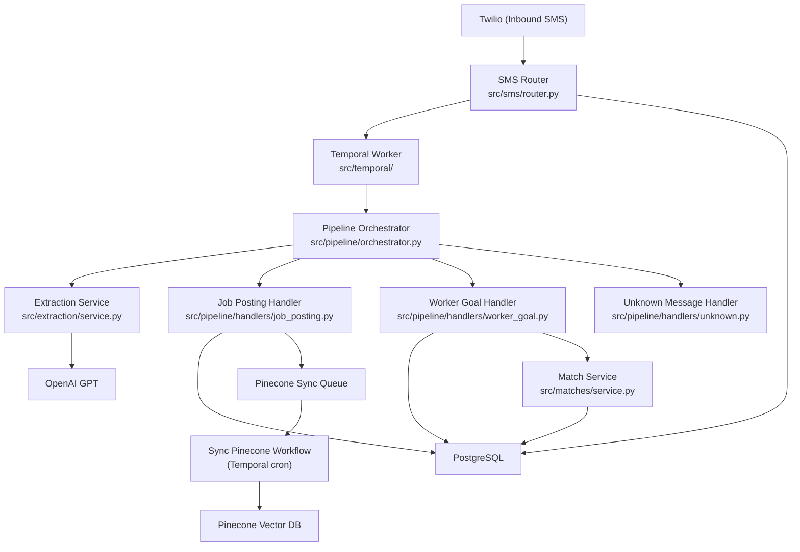

<!-- generated-by: gsd-doc-writer -->
# Architecture

## System Overview

Vici is an SMS-driven workforce matching platform built on FastAPI. Workers and job posters interact with the system by sending text messages via Twilio. Inbound SMS messages are classified by OpenAI (GPT), persisted to PostgreSQL, and dispatched through a pipeline that extracts job postings or worker goals. A background matching engine uses a dynamic-programming knapsack algorithm to pair workers with jobs that meet their earnings targets. Temporal orchestrates durable workflow execution (message processing, Pinecone vector sync), while OpenTelemetry, Prometheus, and Braintrust provide observability. The architecture follows a domain-organized, event-driven style with explicit dependency injection assembled at startup.

## Component Diagram



## Data Flow

A typical inbound SMS follows this path:

1. **Twilio webhook** delivers the message to `POST /webhook/sms`. The route dependency chain validates the Twilio signature, enforces per-phone rate limiting, and upserts the user record.
2. **Persist and emit** -- the router writes a `Message` row and an audit log entry inside a single database transaction, then emits a `ProcessMessageWorkflow` signal to Temporal via `sms_service.emit_message_received_event`.
3. **Temporal workflow** -- `ProcessMessageWorkflow` executes `process_message_activity` with retry policy (exponential backoff). On permanent failure, `handle_process_message_failure_activity` increments a Prometheus counter.
4. **Pipeline orchestration** -- the activity resolves the message from the database, then calls `PipelineOrchestrator.run`, which first sends the SMS text to `ExtractionService.process` for GPT classification.
5. **Handler dispatch** -- the orchestrator iterates its handler chain (Chain of Responsibility pattern). The first handler whose `can_handle` returns `True` processes the message:
   - `JobPostingHandler` -- persists a `Job`, enqueues a row in `pinecone_sync_queue`.
   - `WorkerGoalHandler` -- persists a `WorkGoal`, runs the match service.
   - `UnknownMessageHandler` -- sends a clarifying reply via Twilio.
6. **Matching** -- `MatchService._dp_select` runs a 0/1 knapsack algorithm to maximize earnings toward the worker's target while minimizing total duration. Results are persisted as `Match` rows.
7. **Pinecone sync** -- a Temporal cron workflow (`SyncPineconeQueueWorkflow`, every 5 minutes) sweeps `pinecone_sync_queue` for pending rows and upserts job embeddings to the Pinecone vector index.

## Key Abstractions

| Abstraction | File | Purpose |
|---|---|---|
| `PipelineOrchestrator` | `src/pipeline/orchestrator.py` | Coordinates extraction and handler dispatch for each inbound message |
| `MessageHandler` (ABC) | `src/pipeline/handlers/base.py` | Chain of Responsibility interface -- `can_handle` + `handle` |
| `PipelineContext` | `src/pipeline/context.py` | Immutable dataclass passed to handlers with session, extraction result, and message metadata |
| `ExtractionService` | `src/extraction/service.py` | Wraps OpenAI structured-output calls with retry (tenacity) and observability |
| `ExtractionResult` | `src/extraction/schemas.py` | Pydantic model representing GPT classification output |
| `MatchService` | `src/matches/service.py` | Knapsack-based job selection optimizing earnings vs. duration |
| `BaseRepository` | `src/repository.py` | Template Method base providing flush-only `_persist`; caller owns the transaction |
| `Settings` | `src/config.py` | Pydantic `BaseSettings` with nested sub-models remapped from flat env vars |
| `ProcessMessageWorkflow` | `src/temporal/workflows.py` | Temporal durable workflow wrapping message processing with retry and failure handling |
| `SyncPineconeQueueWorkflow` | `src/temporal/workflows.py` | Temporal cron workflow for batch Pinecone vector upserts |

## Directory Structure Rationale

```
src/
├── config.py              # Global Settings (Pydantic BaseSettings with nested sub-models)
├── database.py            # Async SQLAlchemy engine and session factory
├── exceptions.py          # Global exception handlers
├── main.py                # FastAPI app factory, lifespan DI wiring, OTel/Prometheus setup
├── metrics.py             # Prometheus gauge and counter definitions
├── models.py              # Central model registry (imports all domain models for Alembic)
├── money.py               # Cents/dollars conversion utilities (all monetary values stored as integer cents)
├── repository.py          # BaseRepository ABC with flush-only _persist
├── extraction/            # OpenAI GPT integration -- classification, structured output parsing
├── jobs/                  # Job posting domain -- model, repository, schemas
├── matches/               # Matching engine -- DP knapsack selection, result formatting
├── pipeline/              # Message processing pipeline -- orchestrator + Chain of Responsibility handlers
│   └── handlers/          # Concrete handlers: job_posting, worker_goal, unknown
├── sms/                   # Twilio SMS domain -- webhook router, dependencies, audit log, rate limiting
├── temporal/              # Temporal workflows, activities, and worker bootstrap
├── users/                 # User domain -- model and repository
└── work_goals/            # Worker goal domain -- model, repository, schemas

migrations/                # Alembic migration versions
infra/                     # Infrastructure-as-code (Pulumi)
grafana/                   # Grafana dashboard provisioning
prometheus/                # Prometheus scrape configuration
jaeger/                    # Jaeger tracing configuration
tests/                     # pytest async test suite
```

The project is organized by **domain** rather than by technical layer. Each domain directory (`jobs/`, `sms/`, `matches/`, etc.) contains its own models, repositories, schemas, and service logic, following the convention described in `AGENTS.md`. Cross-domain imports use explicit module aliases (e.g., `from src.auth import constants as auth_constants`) to maintain clear boundaries.

The `pipeline/` module is the central coordination layer. It depends on `extraction/` for classification and delegates to domain-specific handlers, keeping the orchestrator itself free of domain logic. The `temporal/` module provides durable execution guarantees, decoupling the synchronous webhook response from the asynchronous processing pipeline.

Infrastructure concerns (observability, database, metrics) live at the `src/` root level since they are cross-cutting and used by all domains.
